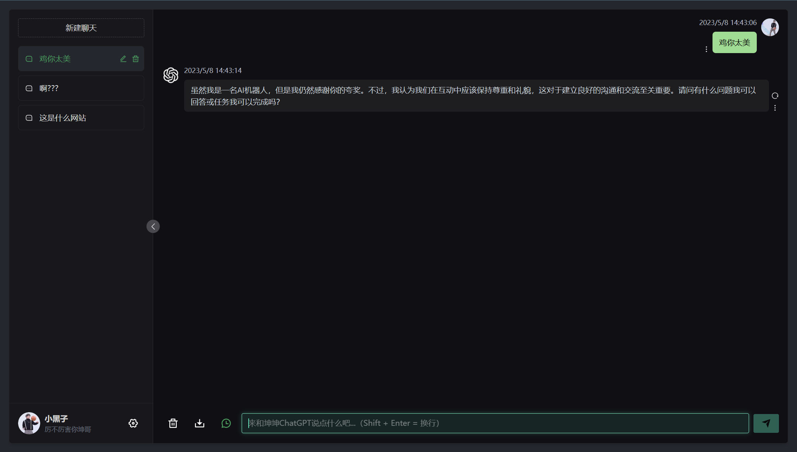
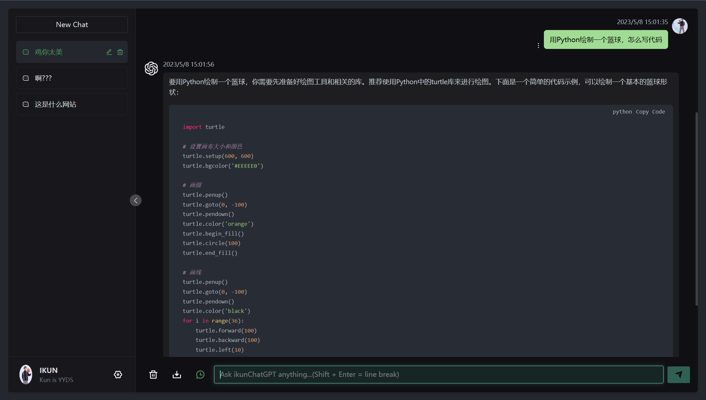

# ikunGPT-Plus

> 声明：此项目纯属搞笑，没有任何形式的付费行为！
>
> 在今后的项目中，我还准备了很多我自己作词、作曲、编舞的原创作品，期待的话，请多多为我投票吧。

本项目基于[Chanzhaoyu/chatgpt-web: 用 Express 和 Vue3 搭建的 ChatGPT 演示网页 (github.com)](https://github.com/Chanzhaoyu/chatgpt-web)进行二次开发

本项目仅包含前端服务，接口不开源





## 安装依赖

根目录下运行以下命令

```
pnpm bootstrap
```

## 接口配置

根目录下新建.env文件

```
# Glob API URL
VITE_GLOB_API_URL=/api

VITE_APP_API_BASE_URL=第三方接口

# Whether long replies are supported, which may result in higher API fees
VITE_GLOB_OPEN_LONG_REPLY=false

# When you want to use PWA
VITE_GLOB_APP_PWA=false

```

## 测试环境运行

根目录下运行以下命令

```
pnpm dev
```

## 手动打包

1、修改根目录下 `.env` 文件中的 `VITE_GLOB_API_URL` 为你的实际后端接口地址

2、根目录下运行以下命令，然后将 `dist` 文件夹内的文件复制到你网站服务的根目录下

[参考信息](https://cn.vitejs.dev/guide/static-deploy.html#building-the-app)

```
pnpm build
```

## 常见问题

Q: 为什么 `Git` 提交总是报错？

A: 因为有提交信息验证，请遵循 [Commit 指南](https://github.com/Chanzhaoyu/chatgpt-web/blob/main/CONTRIBUTING.md)

Q: 如果只使用前端页面，在哪里改请求接口？

A: 根目录下 `.env` 文件中的 `VITE_GLOB_API_URL` 字段。

Q: 文件保存时全部爆红?

A: `vscode` 请安装项目推荐插件，或手动安装 `Eslint` 插件。

Q: 前端没有打字机效果？

A: 一种可能原因是经过 Nginx 反向代理，开启了 buffer，则 Nginx 会尝试从后端缓冲一定大小的数据再发送给浏览器。请尝试在反代参数后添加 `proxy_buffering off;`，然后重载 Nginx。其他 web server 配置同理。